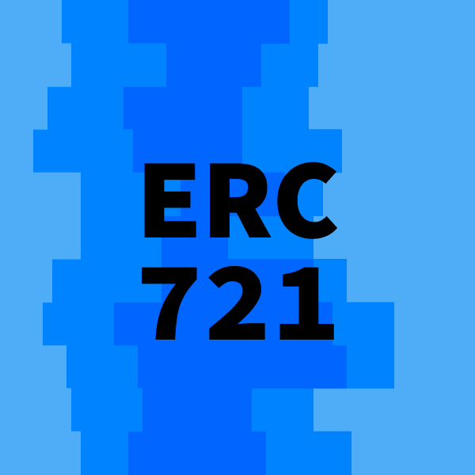

# Generic ERC721 Subgraph

This is a generic ERC721 Subgraph implementation based on OpenZeppelins
[ERC721](https://github.com/OpenZeppelin/openzeppelin-contracts/blob/master/contracts/token/ERC721/ERC721.sol),
[ERC721Enumerable](https://github.com/OpenZeppelin/openzeppelin-contracts/blob/master/contracts/token/ERC721/extensions/ERC721Enumerable.sol)
and
[ERC721Metadata](https://github.com/OpenZeppelin/openzeppelin-contracts/blob/master/contracts/token/ERC721/extensions/IERC721Metadata.sol)
contracts.

This example uses the
[Hashmasks contract](https://etherscan.io/address/0xc2c747e0f7004f9e8817db2ca4997657a7746928),
but it can easily be forked and pointed to another contract that follows this
standard.

See playground:
https://thegraph.com/explorer/subgraph/schmidsi/generic-erc721-subgraph

## Fork and use your own contract

The only thing that you need to change is the [`subgraph.yaml`](./subgraph.yaml)
and [`package.json`](./package.json).

In `subgraph.yaml`, change the lines indicated with `# Change me`. The `name` is
the name of your token, the `address` is where it is deployed and `startBlock`
is the block in which the token was deployed.

In `package.json` you need to search and replace
`schmidsi/generic-erc721-subgraph` with your Subgraph ID in the form of
`account-name/subgraph-name`. See
https://thegraph.com/docs/deploy-a-subgraph#create-a-graph-explorer-account

Now you can deploy and index your token. Feel free to extend the
[`schema.graphql`](./schema.graphql) and the [`mappings.ts`](./src/mappings.ts)
